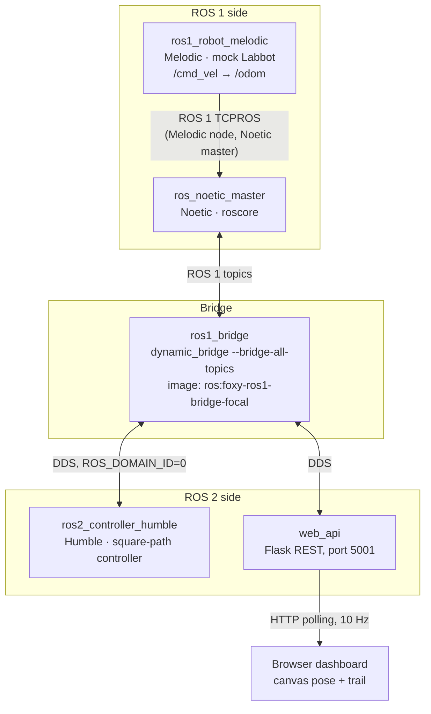

# ROS 1 → ROS 2 Bridge for a Melodic Robot

Controlling a ROS 1 **Melodic** robot from a ROS 2 **Humble** node, by chaining two ROS distributions together in Docker — because the official `ros1_bridge` does not support Melodic.

## Context

Semester project (Poznań University of Technology), targeting **Labbot**, a lab differential-drive robot that runs ROS 1 Melodic. Worked on in a pair during classes. Developed entirely on Apple Silicon (M4).

The goal was to write the robot's controller in ROS 2 Humble while the robot itself stays on Melodic.

> **Status:** validated end to end against a **simulated (mock) robot**. It has **not** been tested on the physical Labbot.

## The problem

`ros1_bridge` is only distributed for ROS 1 **Noetic** paired with a ROS 2 distribution. There is no Melodic↔Humble bridge, and building one from source means compiling both distributions' message definitions against each other — on an ARM Mac, for a robot that cannot be upgraded.

## The design decision

Instead of bridging Melodic directly, the chain exploits the fact that **ROS 1's wire protocol is compatible across distributions**: a Melodic node can register with a Noetic master. That turns an unsupported bridge into a supported one.



Two details worth naming, because they are easy to get wrong:

- **The bridge container is Foxy-based** (`ros:foxy-ros1-bridge-focal`). The Humble controller does not talk to the bridge directly — it reaches the Foxy side **over DDS**, which interoperates for the standard message types used here (`geometry_msgs/Twist`, `nav_msgs/Odometry`).
- **The Humble image is pinned to `linux/amd64`** and runs emulated on Apple Silicon. It works, but it is noticeably slower than native.

## What works

- A Humble node publishes `/cmd_vel`; it arrives at the Melodic node through the full chain.
- The Melodic mock robot integrates the commands and publishes `/odom` back the other way.
- The robot drives a closed square and returns near its starting point.
- A browser dashboard draws live pose and trail from the REST API at 10 Hz.

<!-- TODO: record a GIF of the square run + dashboard and drop it here:
 -->

## Running it

```bash
git clone https://github.com/kubuswes2003/ros-bridge-labbot-demo.git
cd ros-bridge-labbot-demo

docker compose -f docker-compose-dual-bridge.yml up --build
```

Then open `visualization/index.html` in a browser. The dashboard polls `http://localhost:5001/api/robot_state`.

Useful checks while it runs:

```bash
# ROS 2 side sees the bridged topics
docker exec -it robot_controller_humble bash -c "source /opt/ros/humble/setup.bash && ros2 topic list"

# ROS 1 side sees the commands arriving
docker exec -it ros_noetic_master bash -c "source /opt/ros/noetic/setup.bash && rostopic echo /cmd_vel"
```

## Repository layout

The three compose files are the three stages of getting there; the last one is the one that matters.

| File | Stage |
|---|---|
| `docker-compose.yml` | Starting point: Noetic + Foxy, the officially supported pairing |
| `docker-compose-melodic-humble.yml` | Attempt at a direct Melodic↔Humble bridge — kept because it documents what does **not** work |
| `docker-compose-dual-bridge.yml` | **The working setup**: Melodic → Noetic master → bridge → Humble |

```
ros1_robot_melodic/        # mock Labbot on Melodic (the "robot")
ros1_robot/                # stage-1 Noetic mock robot
ros1_robot_noetic_backup/  # earlier Noetic variant, kept for reference
ros2_controller/           # Foxy controller + Flask web API (simple_web_api)
ros2_controller_humble/    # Humble controller — the actual target
visualization/             # dashboard (index.html, script.js, style.css)
```

## Limitations and what I would improve

- **Not tested on the physical Labbot.** Everything so far runs against a mock robot; behaviour on real hardware (latency, wheel slip, motor limits) is unverified.
- **The controller is open-loop.** The square is driven by timing — 3.5 s forward, then a timed rotation — which gives roughly 1.75 m sides. Odometry is subscribed and displayed but never used to correct the path. A closed-loop controller with pose feedback is the obvious next step.
- **The mock robot is a kinematic integrator**: no dynamics, no noise, no wheel slip, so it is a test of the *plumbing*, not of the control.
- **The bridge relays all topics** (`--bridge-all-topics`), which is convenient but wasteful; a fixed topic mapping would be better.
- The dashboard polls over HTTP instead of using a websocket (`visualization/websocket-bridge.py` is an unused earlier attempt).
- Startup depends on `sleep` calls in compose commands rather than real health checks.
- Code comments and log messages are in Polish.
